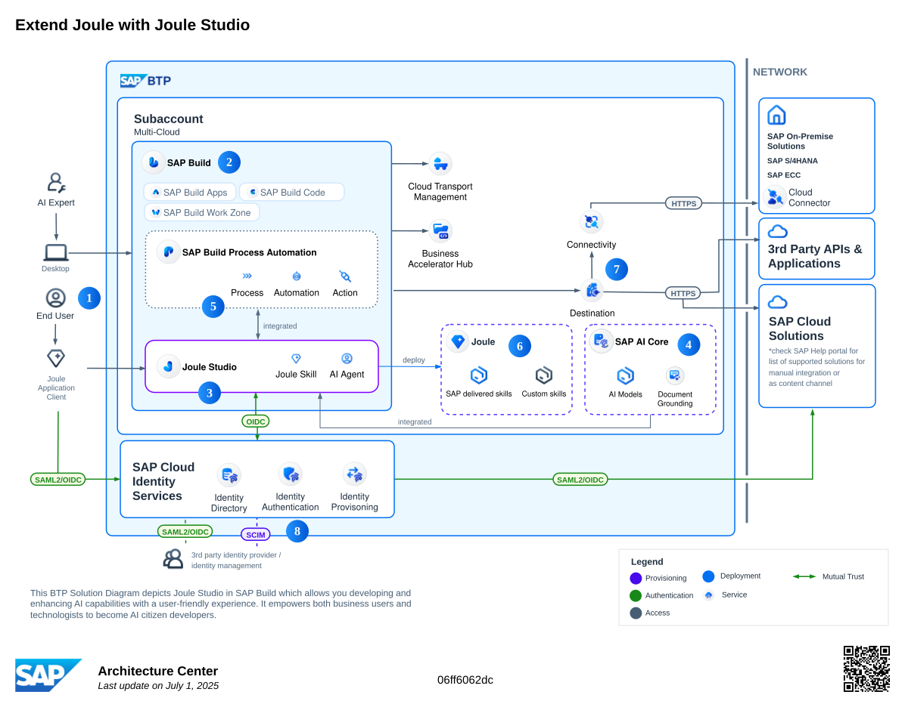
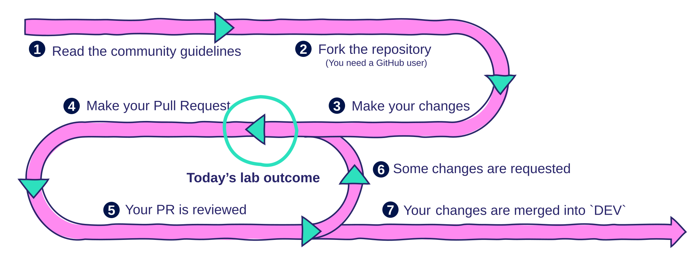

# Kickstart your SAP BTP Journey with Architectures and Use Cases

## Description

Architect, cost, and plan an SAP BTP use case in this hands-on session. Using assets from the SAP Architecture Center, Discovery Center, and BTP Guidance Framework, you will design a solution architecture for a real-world scenario, estimate its cost, and create a high-level implementation plan. Leave with a repeatable methodology for bringing your enterprise solutions from concept to reality.

## Lab Requirements

- [An SAP Account](https://www.sap.com/account.html)
- [A GitHub Account](https://docs.github.com/en/get-started/start-your-journey/creating-an-account-on-github)

## Exercises

| #   | Title                                                                 |
| --- | --------------------------------------------------------------------- |
| 0   | [**Refresher on SAP BTP Basics**](./exercises/ex0/)                   |
| 1   | [**Explore the SAP Architecture Center**](./exercises/ex1/)           |
| 2   | [**Explore SAP BTP Services and Content**](./exercises/ex2/)          |
| 3   | [**Extending a Reference Architecture in draw.io**](./exercises/ex3/) |
| 4   | [**Validate your BTP Solution Diagram**](./exercises/ex4/)            |
| 5   | [**Make your Reference Architecture Official**](./exercises/ex5/)     |

## Case Study — Consolidating Payroll Information

Resource: [Interactive Value Journey — Designing custom Joule skills in Joule Studio](https://url.sap/skilldesign)

### Status Quo

Our enterprise, **BestRun**, uses **SAP SuccessFactors** as its core HR system, but handles payslips and tax documents through a third-party provider, **SecurePayroll**.

### Desired Outcome

We would like to empower employees to access their payroll, tax information, and core HR services seamlessly from one simple interface, thereby improving response times and reducing HR support tickets.

### Proposed Solution

Create **Joule skills** to...

> _Enable employees to securely access payslips and tax documents from third-party payroll systems directly within SAP SuccessFactors using Joule. Simplifies the user experience by removing the need for separate logins and streamlines payroll communication to HR._

The video below showcases our proposed solution.

 

 

> [!NOTE]
>
> The conversation is shown in Joule Studio's test environment. Upon deployment, the defined custom skill will be accessible through Joule in SAP SuccessFactors.

 

## A Reference Architecture Starting Point

Let's take a look at the specific reference architecture we'll use as the foundation for the remaining exercises:

[**Extend Joule with Joule Studio**](https://architecture.learning.sap.com/docs/ref-arch/06ff6062dc)

> _This reference architecture outlines how Joule Studio can be leveraged to integrate and extend SAP and non-SAP solutions across cloud and hybrid landscapes. By tapping into the expertise of citizen developers, Joule Studio facilitates the adaptation, improvement, and innovation of business processes, driving positive business outcomes through sophisticated AI capabilities._

 

 

> [!NOTE]
>
> Before we explore the architecture in detail, it's important to understand Joule, Joule Studio, and Joule Skills. Check out this [additional reading](./extra-readings/Joule.md) on these topics.

 

## SAP Architecture Center | Community of Practice

By the end of this lab, you will have completed many of the steps required for a [contribution to the SAP Architecture Center](https://architecture.learning.sap.com/community/intro). Here's what's left to do:

 

 

## Implementation & Beyond

With your solution architecture, cost estimate, and high-level plan in hand, you are ready to begin implementation. The SAP Discovery Center Mission provided below is an excellent starting point, offering a guided, hands-on experience to build out a similar scenario.

SAP Discovery Center Mission — [Build custom Joule skills for SAP and non-SAP systems using Joule Studio](https://discovery-center.cloud.sap/missiondetail/4643/4932/)

By completing this lab, you have gained a repeatable methodology for bringing your enterprise solutions from concept to reality. You have learned how to:

- Navigate the SAP Architecture Center to find reference architectures for your use cases.
- Utilize the SAP Discovery Center to explore BTP services and estimate the cost of your solution.
- Leverage the SAP BTP Guidance Framework for guides, methodologies, and more.
- Adapt and extend a reference architecture to meet your specific business requirements.
- Understand the process for contributing your work back to the SAP community.

You are now equipped with the foundational skills to architect, cost, and plan your own SAP BTP use cases.

## Known Issues

No known issues.

## How to obtain support

[Create an issue](https://github.com/SAP-samples/btp-kickstart-your-journey-with-architecture/issues) in this repository if you find a bug or have questions about the content.

For additional support, [ask a question in SAP Community](https://answers.sap.com/questions/ask.html).

## Contributing

If you wish to contribute code, offer fixes or improvements, please send a pull request. Due to legal reasons, contributors will be asked to accept a DCO when they create the first pull request to this project. This happens in an automated fashion during the submission process. SAP uses [the standard DCO text of the Linux Foundation](https://developercertificate.org/).

## License

Copyright (c) 2025 SAP SE or an SAP affiliate company. All rights reserved. This project is licensed under the Apache Software License, version 2.0 except as noted otherwise in the [LICENSE](LICENSE) file.
