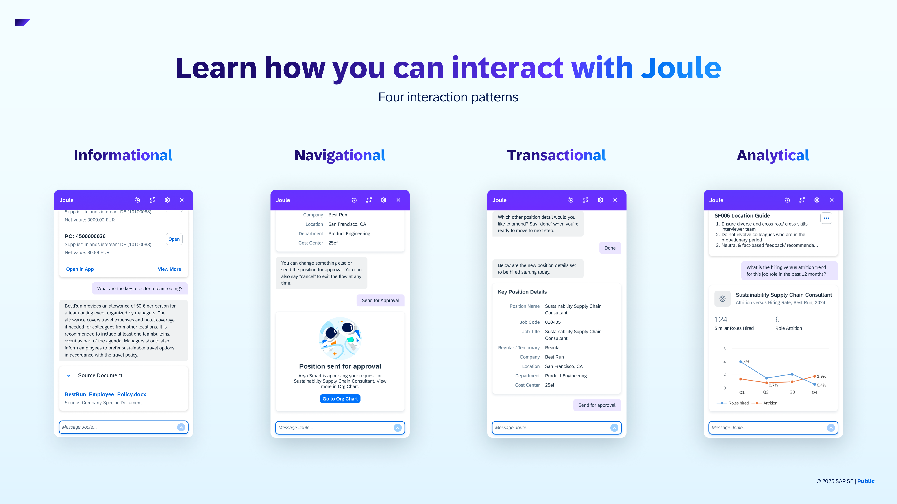
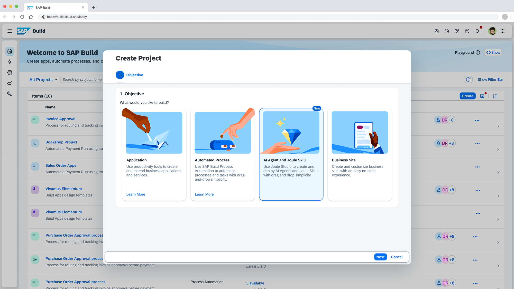

# Fast Track Adoption of SAP Business Technology Platform

<!-- Please include descriptive title -->

<!--- Register repository https://api.reuse.software/register, then add REUSE badge:

-->

## Description

Architect, cost, and plan an SAP BTP use case in this hands-on session. Using assets from the SAP Architecture Center, Discovery Center, and BTP Guidance Framework, you will design a solution architecture for a real-world scenario, estimate its cost, and create a high-level implementation plan. Leave with a repeatable methodology for bringing your enterprise solutions from concept to reality.

## Requirements

- [A GitHub Account](https://docs.github.com/en/get-started/start-your-journey/creating-an-account-on-github)
- [An SAP Account](https://www.sap.com/account.html)

## Introduction

10 min

- Agenda
- Articulate specific session goals:
  - How will the resources above empower attendees?
  - What knowledge & skills will attendees leave this session with?
- Reminder: GitHub & SAP accounts are required
- Explainer: How to follow along with session exercises & content in GitHub

## Exercise 0: Refresher on SAP BTP Basics

10 min

- Goal: Familiarize attendees with SAP BTP basics, SAP Discovery Center, and SAP BTP Guidance Framework
- Scavenger hunt & quiz
  - Attendees can bookmark resources as they go along
  - Start on the SAP Discovery Center homepage
  - Find the SAP BTP Guidance Framework
  - Dive into the SAP BTP Administration Guide
    - Drill down into the Core Concepts section to find the needed info for a quiz
  - End with a short 3-5 question quiz

## Recap on Content So Far

5 min

- Brief recap for each of the following:
  - [SAP Discovery Center](https://discovery-center.cloud.sap/)
  - [SAP BTP Guidance Framework](https://discovery-center.cloud.sap/guidance-framework)
  - Core SAP BTP Concepts

## Present a Business Scenario

10 min

- Very brief demo of the target outcome - Joule skills demo
  - Business scenario overview, no deep technical details at this point

## Exercise 1: Navigating to Architecture Center

5 min

- Goal: Familiarize attendees with SAP Discovery Center, SAP BTP Guidance Framework, and SAP Architecture Center
- Potential Quiz Questions:
  - What is the right resource to discover reference architectures?
  - Which reference architectures are applicable to the scenario we described earlier?
- Scavenger hunt & quiz
  - Attendees can bookmark resources as they go along
  - Back in the SAP BTP Guidance Framework, find the SAP Architecture Center
  - Use the provided hints & tags to find the specific architecture we will dive into during this session
  - End with a short 3-5 question quiz

> KEY POINT - We have now identified the [reference architecture](https://architecture.learning.sap.com/docs/ref-arch/06ff6062dc) we will use for the rest of the session.

## Recap on the Core Resources

5 min

- Brief recap for each of the following:
  - [SAP Discovery Center](https://discovery-center.cloud.sap/)
  - [SAP BTP Guidance Framework](https://discovery-center.cloud.sap/guidance-framework)
  - [SAP Architecture Center](https://architecture.learning.sap.com/)

## Introducing a Reference Architecture

Let's take a look at the specific reference architecture we'll use as our foundation for the remaining exercises:

[**Extend Joule with Joule Studio**](https://architecture.learning.sap.com/docs/ref-arch/06ff6062dc)

> _This reference architecture outlines how Joule Studio can be leveraged to integrate and extend SAP and non-SAP solutions across cloud and hybrid landscapes. By tapping into the expertise of citizen developers, Joule Studio facilitates the adaptation, improvement, and innovation of business processes, driving positive business outcomes through sophisticated AI capabilities._

 

---

 

❗NOTE: **Before we dive deep into the architecture itself, we must understand Joule, Joule Studio, and Joule Skills.**

### Joule

Resource: [Deep Dive into Joule](https://content-discovery.int.sap/assets/0b75b63a-14aa-48c1-b745-f6439a7077a6?referer=%2F%3FtextSearch%3DDeep%2BDive%2Binto%2BJoule)

> _Joule, the AI copilot that truly understands your business._

 

| Interaction pattern |                                                                                                                                                                                                                                                                                                                              |
| ------------------- | ---------------------------------------------------------------------------------------------------------------------------------------------------------------------------------------------------------------------------------------------------------------------------------------------------------------------------- |
| Informational       | _With informational interactions, Joule provides knowledge-based results. Information based on SAP Help Documentation will be available for all SAP cloud applications. With Document Grounding, you can upload your own content, e.g. HR & travel policies or FAQs._                                                        |
| Navigational        | _With Joule, you can easily navigate across SAP products with navigational interactions. Joule offers a navigational link that opens the relevant application and interface in a new browser tab. At the destination, you can continue from where you left off, with your previous conversation history and context intact._ |
| Transactional       | _Transactional interactions allow you to access backend systems and manage business processes through natural language and AI. This includes tasks like approving purchase orders, creating job positions, or other actions (create, read, update, delete) across SAP business processes._                                   |
| Analytical          | _Joule supports analytical interactions. You can ask analytical questions while Joule leverages Just Ask in SAP Analytics Cloud to provide analytical insights._                                                                                                                                                             |

 

### Joule Studio

Resource: [Joule Studio (sap.com)](https://www.sap.com/products/artificial-intelligence/joule-studio.html)

> _Joule Studio is a capability in SAP Build that allows organizations to create and deploy custom Joule agents and skills that automate workflows and improve efficiency across SAP and non-SAP systems._

 

 

### Joule Skills

Resource: [Joule Studio, skill builder (SAP Discovery Center)](https://discovery-center.cloud.sap/ai-feature/e93aa292-e7f4-449d-9586-f1a8510d5ab6/)

> _Joule skills are designed to execute atomic, predefined operations within a business context through Joule's conversational interface. By performing single tasks such as retrieving specific data or executing system transactions, Joule skills ensure developers and business users fast, reliable, and reusable automation for high-frequency operations._

 

| Joule skill type     |                                                                          |
| -------------------- | ------------------------------------------------------------------------ |
| SAP delivered skills | _Available to Joule out-of-the-box, dependent on your system landscape._ |
| Custom skills        | _Designed in and deployed from Joule Studio._                            |

 

| Key characteristics of Joule skills |                                                                                                                          |
| ----------------------------------- | ------------------------------------------------------------------------------------------------------------------------ |
| Intent-driven                       | _Each skill is triggered by a user’s natural-language input (intent) and performs a specific task._                      |
| Composable                          | _Skills can be combined to create richer interactions and workflows._                                                    |
| Low-code                            | _Built using an intuitive interface._                                                                                    |
| Action Projects                     | _Allow skills to connect to remote systems (e.g., SAP S/4HANA, SAP Ariba, or Northwind) to fetch or post data via APIs._ |
| Extensible                          | _Developers and business users can customize skills to align with specific business processes or domain needs._          |

 

___

### Architecture Diagram

- Explain the architecture diagram, introducing the Service & AI Catalogs in SAP Discovery Center, with a core focus on the following services/features:
  - SAP Build
  - Joule Studio
  - SAP Cloud Identity Services
  - SAP AI Core

**Exercise 2: SAP Discovery Center Service Catalog & Estimator**

10 min

- Use the SAP Discovery Center Service Catalog to identify one of the core components (likely SAP AI Core) from the reference architecture diagram
- Consider the suggested business scenario, its required workloads, and the user base
  - Use these factors + the Service Estimator to develop a pricing estimate
- Quiz to verify the pricing estimate

**Exercise 3: Extending an Architecture in Draw.io**

20 min

- Consider a new functional requirement that presents an architecture change
  - Use the Service Catalog to identify the relevant service based on hints
- [Draw.io](https://app.diagrams.net/) introduction & setup demo
- Enable the SAP draw.io extension
- Reference the [SAP BTP Solution Diagram Design Repository](https://sap.github.io/btp-solution-diagrams/) as needed
- Add the new service (e.g. SAP Document AI)
- Delete unnecessary connections & boxes, add desired/suggested modifications

**SAP Architecture Center - New Features**

5 min

- Introduce the Architecture Validator & Quick-start Features

**Exercise 4: Validate your Architecture Diagram**

5 min

- The diagram should be near its final form, use the validator tool to spot any issues
- Make changes in Draw.io to address any warnings raised by the validator

**Exercise 5: Making your Reference Architecture Official**

10 min

- Your diagram has significant changes from the original, update the accompanying documentation using the Quick-start feature
- Insert your completed diagram
- Publish!

**SAP Architecture Center's Community of Practice**

5 min

- You've completed most of the required steps for a contribution in this session, we'll show you what's left to do

**Implementation and Beyond**

5 min

- Introduce the corresponding SAP Discovery Center Mission as a starting point for implementation of a similar scenario

**Recap and Outro**

5 min

## Known Issues

No known issues.

## How to obtain support

[Create an issue](https://github.com/SAP-samples/<repository-name>/issues) in this repository if you find a bug or have questions about the content.

For additional support, [ask a question in SAP Community](https://answers.sap.com/questions/ask.html).

## Contributing

If you wish to contribute code, offer fixes or improvements, please send a pull request. Due to legal reasons, contributors will be asked to accept a DCO when they create the first pull request to this project. This happens in an automated fashion during the submission process. SAP uses [the standard DCO text of the Linux Foundation](https://developercertificate.org/).

## License

Copyright (c) 2025 SAP SE or an SAP affiliate company. All rights reserved. This project is licensed under the Apache Software License, version 2.0 except as noted otherwise in the [LICENSE](LICENSE) file.
