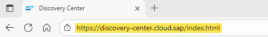
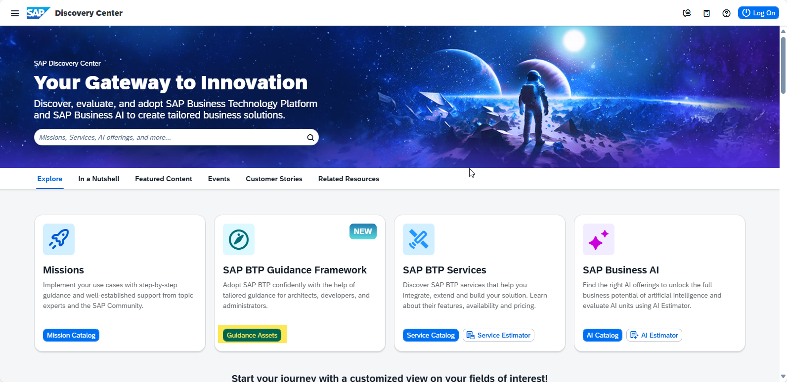
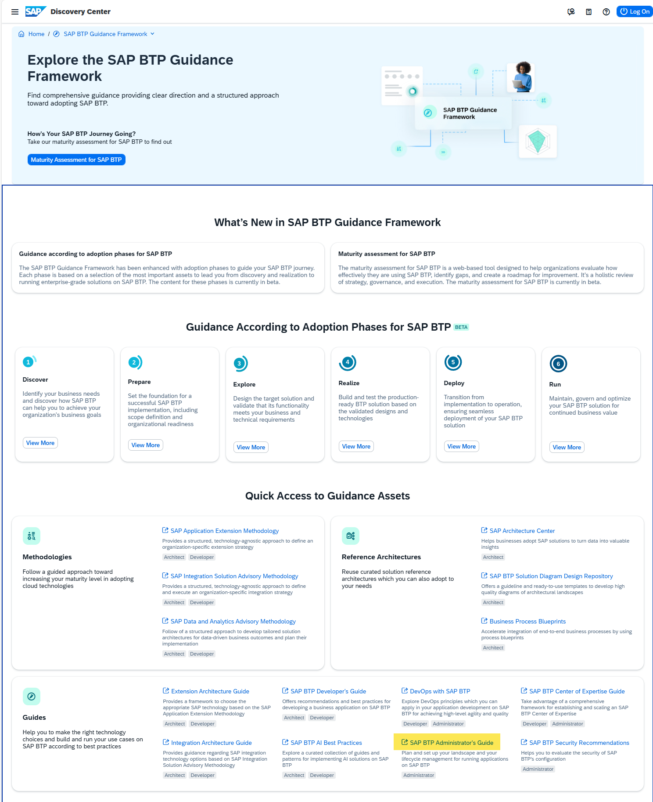
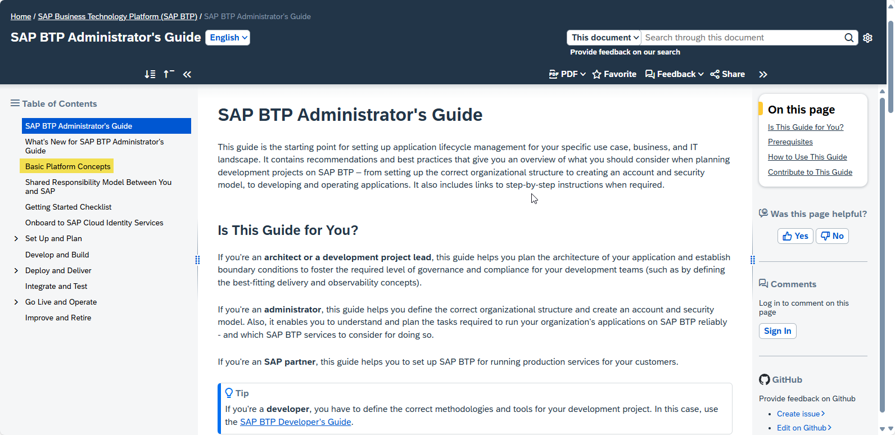
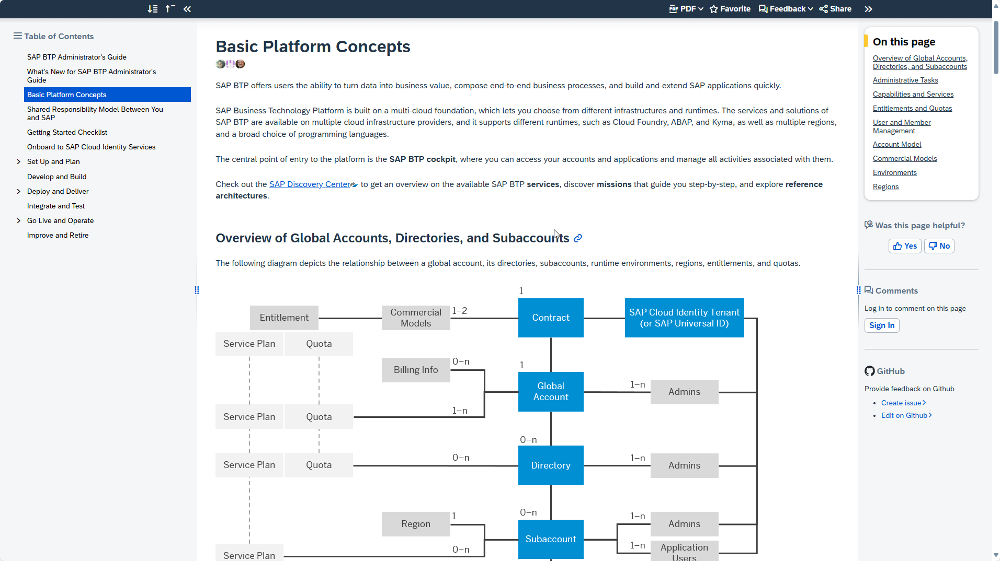

# Exercise 0: Refresher on SAP BTP Basics

[**< Return to the main page**](../../)

 

> [!NOTE]
>
> **Learning Objectives**:
>
> - Get a general understanding or recap of the core concepts of SAP Business Technology Platform. 
> - Introduction to some major information resources for SAP BTP:   > [SAP Discovery Center](https://discovery-center.cloud.sap/)  > [SAP BTP Guidance Framework](https://discovery-center.cloud.sap/guidance-framework) 
>
> **Duration**: ~10 minutes  

## Step 1: SAP Discovery Center

The best starting point for any information on SAP BTP and SAP Business AI is the SAP Discovery Center. 

1. Navigate to [SAP Discovery Center](https://discovery-center.cloud.sap).  
    

   Hint: You may want to create a bookmark for the SAP Discovery Center!

2. Have a look at the content on the main page. The SAP Discovery Center offers all kinds of information on what SAP BTP can do, how it can be used, and what SAP's customers are using it for. It is divided into four main sections:

   - Missions
   - SAP BTP Guidance Framework
   - The BTP Service Catalog with cost estimator
   - AI Scenario Catalog with cost estimator

    

3. Let's start by looking at the SAP BTP Guidance Framework.  
   Press the **SAP BTP Guidance Framework** tile.

## Step 2: The SAP BTP Guidance Framework

The SAP BTP Guidance Framework provides a central entry point to all kinds of guidance documents for different roles like architects, developers, or administrators. 

 

4. Have a look at the different sections of the Guidance Framework and the links to get an overview of what kind of methodologies, information, and guidelines can be found in this repository. 
5. Press the link to the **SAP BTP Administrator's Guide**.

## Step 3: The SAP BTP Admin Guide

The SAP BTP Administrator's Guide covers the information to administer the BTP platform through the different stages of usage: planning, setup, development, deployment, testing, go-live, operations, and retirement of developments.  
 

6. Have a look at the "How to use this Guide" section to understand the structure and usage of the Admin Guide. 
7. To learn about or recap the basic concepts of SAP BTP, navigate to the **Basic Platform Concepts** section.
    

     

8. Make sure that you have a basic understanding of the concepts and dependencies of:

   - Global Accounts
   - Subaccounts
   - Services
   - Entitlements
   - Environments
   - Regions

9. Understand the basic differences between the subscription-based and the consumption-based commercial models.

🧠 **Knowledge check:**

    

        What are the three methodologies that SAP provides in the context of SAP BTP?
    

    The three methodologies are: 
    <ul>
        <li><strong>SAP Application Extension Methodology (AEM)</strong>: Helps to establish an extension strategy for business applications to identify the best-fitting technologies following a clean core approach.</li>
        <li><strong>SAP Integration Solution Advisory Methodology (ISAM)</strong>: Offers a structured, technology-agnostic approach to define and execute an organization-specific integration strategy.</li>
        <li><strong>SAP Data and Analytics Advisory Methodology (DAAM)</strong>: Supports the development of tailored solution architectures for data-driven business outcomes and planning of their implementation.</li>
    </ul>

[**< Return to the main page**](../../)