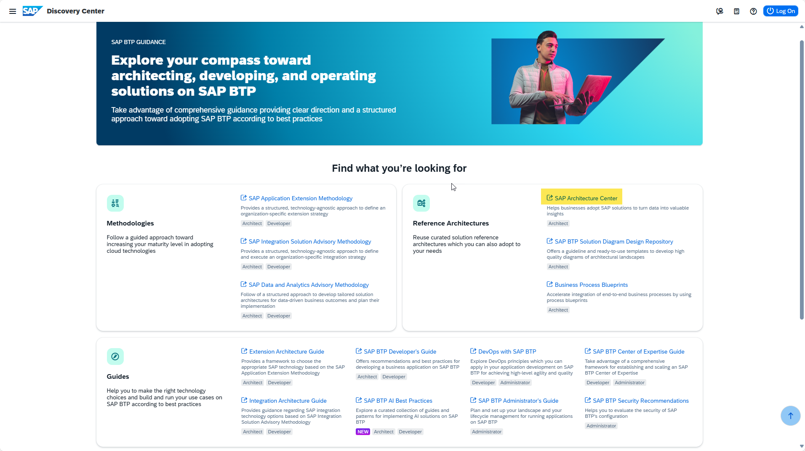
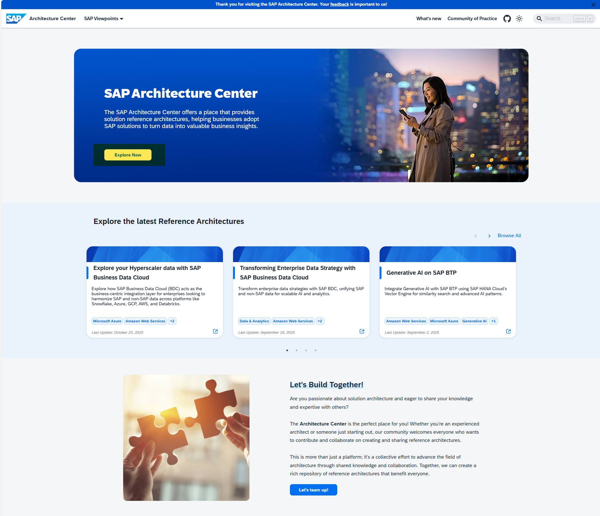
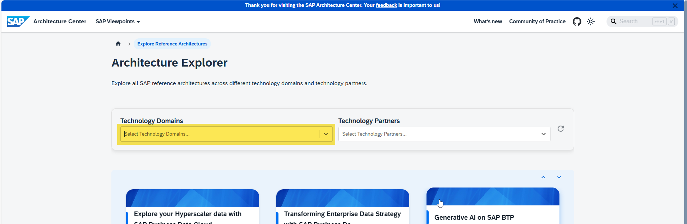
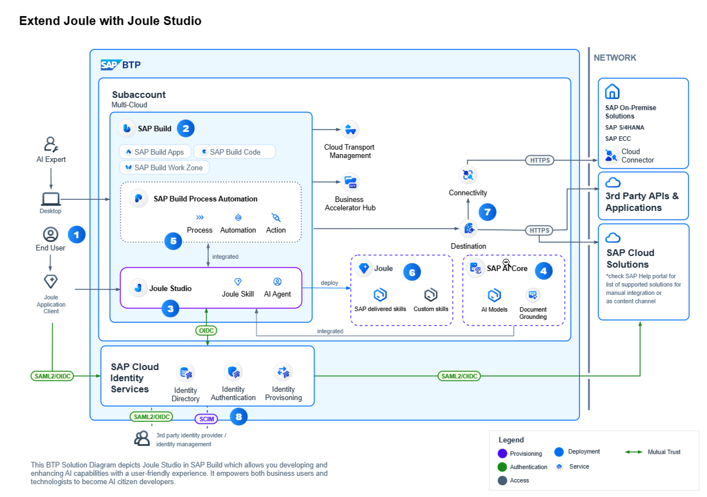

# Exercise 0: Refresher on SAP BTP Basics

[< Return to the main page](../../)

 

> [!NOTE]
>
> **Learning Objectives**:
>
> - Get a general understanding or recap about the core concepts of SAP Business Technology Platform. 
>- Introduction into some major information resources for SAP BTP:  
>    [SAP Discovery Center](https://discovery-center.cloud.sap/) 
>   [SAP BTP Guidance Framework](https://discovery-center.cloud.sap/guidance-framework) 
>
> **Duration**: ~10 minutes  

## Step 1: SAP Discovery Center 
The Best starting point for any information on SAP BTP and SAP Business AI is the SAP Discovery Center. 
1. Navigate to [SAP Discovery Center](https://discovery-center.cloud.sap)  
 

2. Have a look at the content the main page is showing. The SAP Discovery Center is offering all kinds of information on what SAP BTP can do, how it can be used and what SAP's custumers are using it for. It is devided into 4 main sections:  - Missions   - SAP BTP Guidance Framework   - The BTP Service Catalog with cost estimator   - AI Scenario Catalog with cost estimator  

 
3. Let's start to have a look at the SAP BTP Guidance Framework:  
Press the Tile for the SAP BTP Guidance Framework
## Step 2: The SAP BTP Guidance Framework

The SAP BTP Guidance Framework provides a central entry point to all kinds of guidance documents for different roles like architects, developers or administrators. 

 
4. Have a look at the different sections of the Guidance Framework and the links to get an overview about what kind of methodologies, information and guidelines can be found in this repository. 
5. Press the link to the SAP BTP Administrators' guide:

## Step 3: The SAP BTP Admin Guide
The SAP BTP Administrator's Guide covers the information to administer the BTP platform through the different stages of usage - planning, set-up, development, deployment, testing, go-live, operations and retirement of developments.  
 

6. Have a look at the "How to use this Guide" section to understand the structure and usage of the Admin Guide. 
7. To learn about or recap the basic concepts of SAP BTP navigate to the "Basic Platform Concepts"
 

  

8. make sure that you basic understanding of the concepts and dependencies of:  - Global Accounts  - Sub-accounts  - Services  - Entitlements  - environments  - regions  

9. understand the basic differences between the subscription-basedd and the consumption- based commercial models.

Knowledge Check - tbd

Having a general understanding about the main concepts of SAP BTP you would like to get some ideas and inspiration on typical scenarios that SAP BTP is being used for.

10. Navigate back to the SAP BP Guidance Framework 
  

11. Navigate to the SAP Architecture Center  
## Step 4: The Architecture Center  
  
12. To get an overview about the content in the Architecture Center you press the button to "Explore Now" to get to the Architecture Explorer 
13. You decide to filter the architectures by technology domain as you are interested how SAP BTP will be able to help shaping your company's AI strategy, you choose "Artificial Intelligence"

  

14. You remember that there is an open request from your HR department to add some functionalities to the Joule assistant in Successfactors. So, you decide to evaluate the "Extending Joule with Joule Studio" architecture. 

 

15. Read the first paragraph of the explanantion of the scenario to get a basic understanding about Joule and the purpose of the outlined scenario.

 