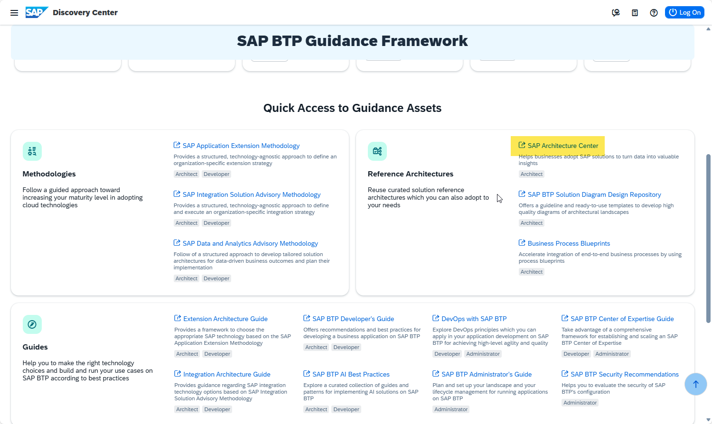
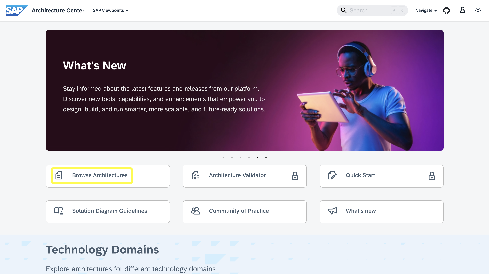
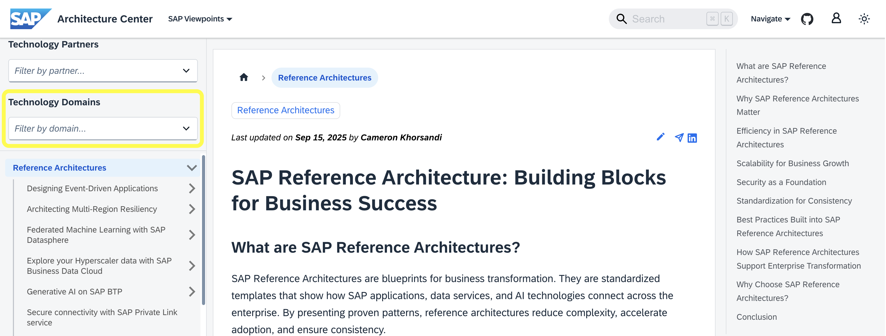
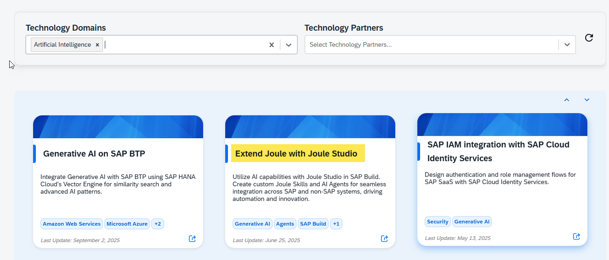

# Exercise 1: Explore the SAP Architecture Center

[**< Return to the main page**](../../)

 

> [!NOTE]
>
> **Learning Objectives**:
>
> - Get an overview of the SAP Architecture Center
>
>   [SAP Architecture Center](https://architecture.learning.sap.com/)
>
> - Navigate within the SAP Architecture Center, get an understanding of the available content, and understand the structure of the described architectures and the provided content in detail.
>
> **Duration**: ~10 minutes  

 

## Introduction to the Architecture Center

To follow up on the given requirements, you decide to see if there are any guidelines to support the given case.

1.  Navigate back to the SAP BTP Guidance Framework.
    

    You decide to see if a reference architecture is available that fits your requirements.

2.  Navigate to the SAP Architecture Center.

    

3.  To get an overview of the content in the Architecture Center, press the "Explore Now" button to go to the Architecture Explorer.
4.  Browse through the different scenarios to get an understanding of the possibilities and the content provided in the SAP Architecture Center.

    Since you are looking for a reference architecture to support extending Joule's capabilities for your end users, you should filter the available reference architectures for those related to artificial intelligence.

5.  Filter the architectures by the "Artificial Intelligence" technology domain.

    

6.  Have a look at the recommended items. Choose the scenario that fits your case ("Extending Joule with Joule Studio").

    

7.  Get familiar with the structure of how the SAP Architecture Center describes the reference architectures in detail. Have a look at the list of services and components, and use the solution diagram and the flow description to understand the described architecture.

    
