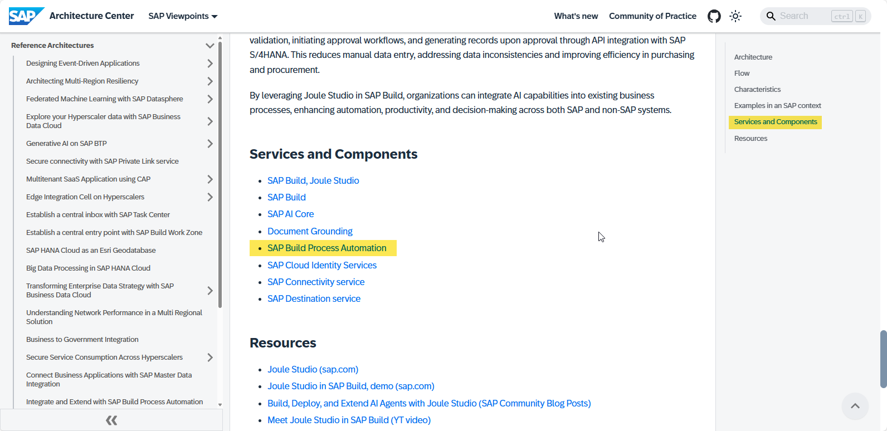
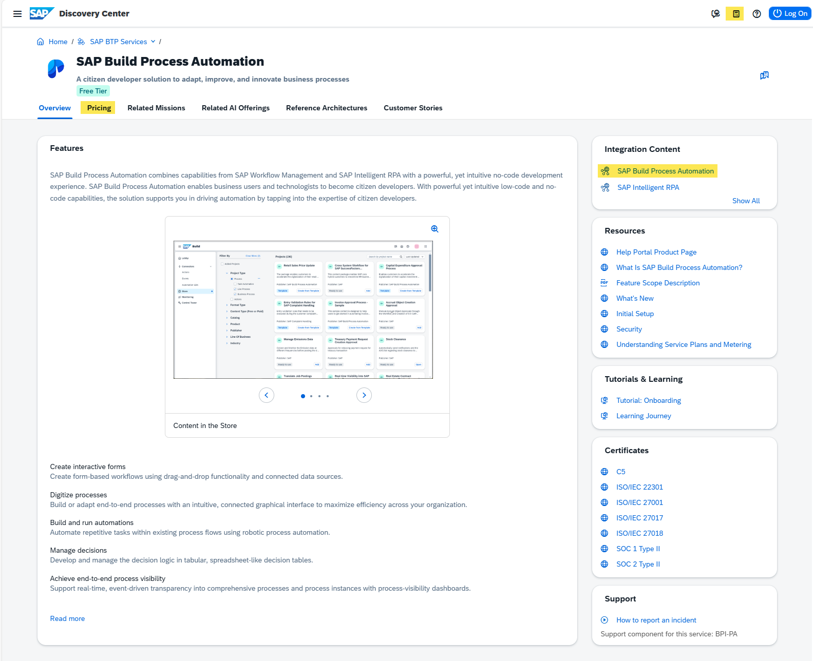
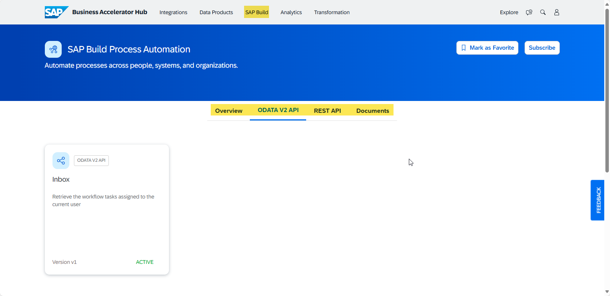
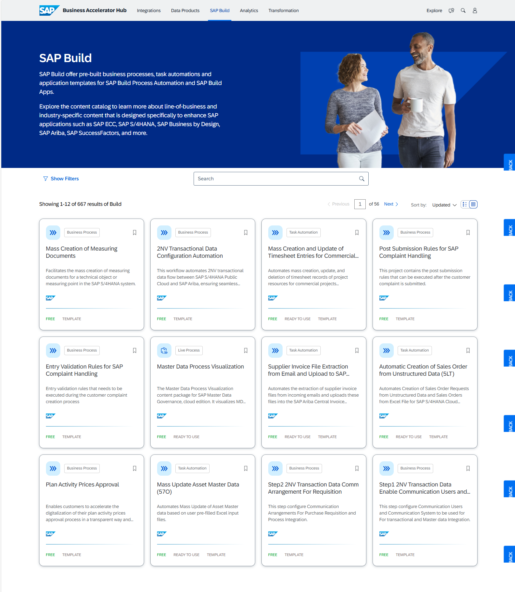
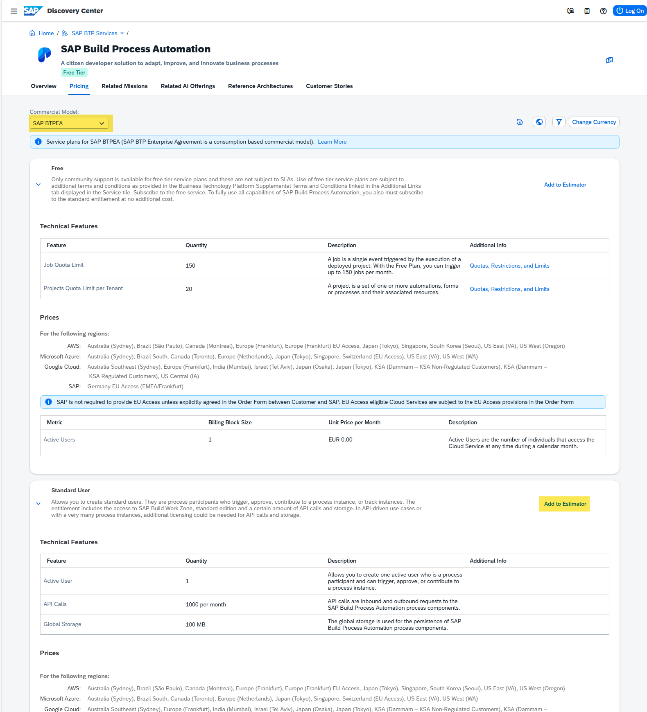
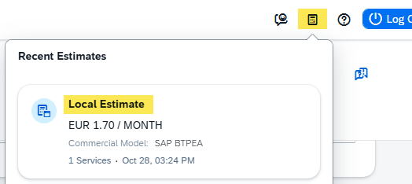
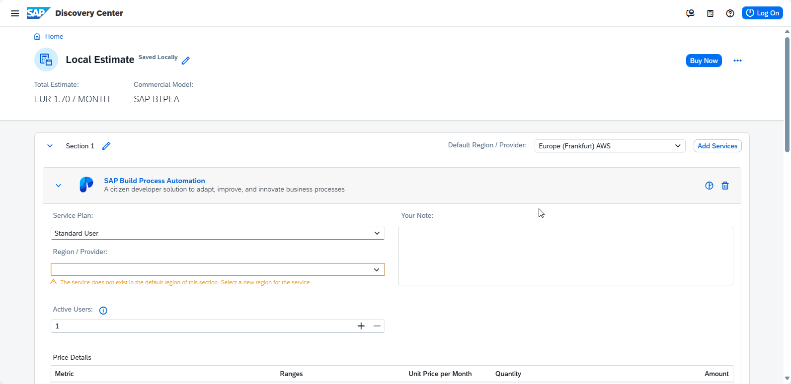
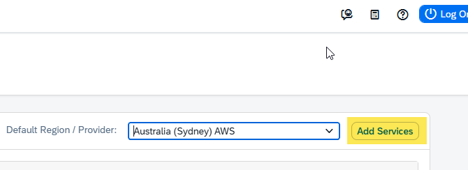
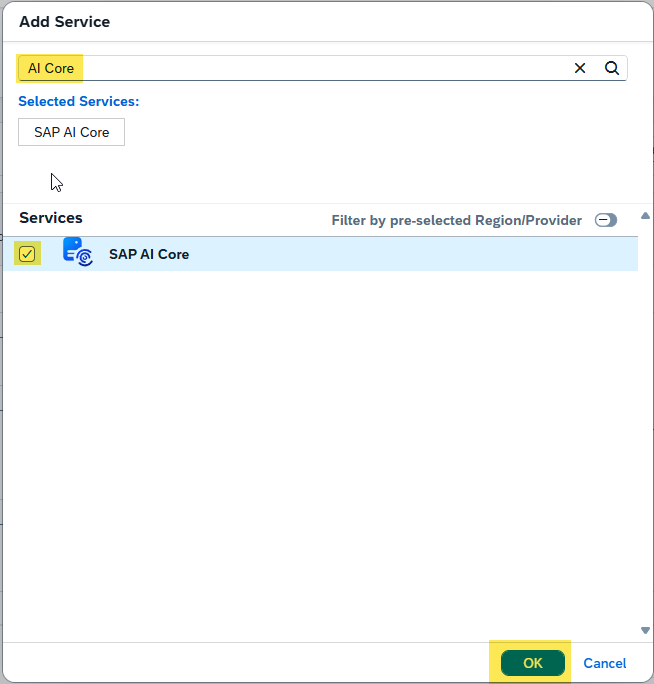
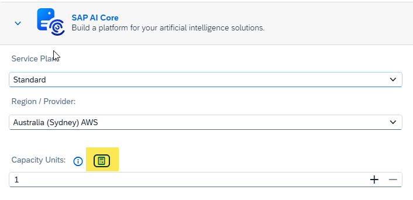

# Exercise 2: Using further resources to get information on SAP BTP's services and content

[< Return to the main page](../../)

 

> [!NOTE]
>
> **Learning Objectives**:
>
> - Example learning objective
>
> **Duration**: ~10 minutes

 

## Step 1: Evaluating details for SAP BTP's services   
As you now have an undersatnding about the necessary BTP services that are part of the chosen architecture you decide to get additional knowledge about the different services (as an example for this we are taking the "SAP Build Process Automation" service)
1. On the "Extend Joule with Joule Studio" page in SAP Architecture Center drill down to the list of services and components of the given architecture. 

 

2. Choose "SAP Build Process Automation" to get details on theis BTP Service

This will open up a new tab/window leading you back to the "SAP Discovery Center" and show the respective page of the chosen service from the Service Catalog 

 

3. Quickly use the features to understand the services' purpose, you can also have a look at the "Customer Stories" or "Related AI Offerings" to understand the usage of the service a bit better. 

As you know that SAP BTP does not only provide technical services but also Business Content, you want to know, if there is already some content available for your service. 

4. Navigate to "SAP Build Process Automation" in the "Integration Content" section  

This will open up a new tab/window opening the product page for SAP Build Process Automation on the "SAP Business Accelerator Hub," which is the central repository for business content for services on SAP BTP.

## Step 2: Browsing Business Content for SAP BTP on SAP Business Accelerator Hub

The page outlines the availability and the definition and documentation of an OData as well as a rest-based API as well as a link to the general service documentation. 

5. Click on "REST API" to also discover details of the possibilities

 

Looking at the general navigation of Business Accelerator Hub,you will also find the link to the pre-packaged integrations for the SAP Integration Suite as well as the available Data Products for the SAP Business Data Cloud offering. 
As you know that "SAP Build Process Automation" is part of the SAP Build Bundle, you want decide to further drill down into the "SAP Build" section. 

6. Navigate to the general content space for SAP Build 

 

7. Browse through the available SAP Build Content to get an understanding about the different types that are available. 

Unfortunately, currently there is no SAP Build content available for your given scenario, so you decide to go back to the Discovery Center

8. Close the SAP Business Accelerator Hub Tab/Window and return to the SAP Build Process Automation Page from the Service Catalog of the SAP Discovery Center

## Step 2: Estimating Costs for a given scenario

To achieve a cost estimation for a scenario you need to understand the commercial situation and the metrics of the required services.

9. Navigate to the "Pricing" Tab of the "SAP Build Process Automation" Page

 

10. Find the commercial model drop-box to see the different models that are available for this service, choose BTPEA.  

11. Understand the different sections for the different service plans that are available for this service, and that there is also a "free Tier" service plan available for the consumption-based contracts, that allows you a free service usage with certain restrictions (described in the service plan section)

12. Navigate to the "Standard User" service plan and read the description to understand that this will be the required license/service plan for the end-users of the scenario.

13. Add this service plan to the estimator (click add to estimator button and a short message will appear that it has been added)

14. Also add "Advanced User" service plan to the estimator accordingly as the description shows that this is the required plan for users that will create or administer scenarios in SAP Build Process Automation.

As you have added the required service plans for SAP Build Process Automation for your scenario now, open up the estimator.

15. Click the small calculator symbol at the top right of the page to open the estimator and chose "Local Estimate"

 

The estimator page is going to show up: 

 

16. You can name your estimation and check on calculation period, commercial model and further general settings by pressing on the pencil symbol

17. Make sure to select the preferred region of deployment as well as the needed number of users for both of the service plans added to the estimator 

Be aware that BTP uses active users as user metric and that you are calculating for a consumption based model (BTPEA) This means that these values reflect the actual number of users of the service over the course of one month for the overall period of a full year! Less consumption/usage in some month will save credits for months of high usage...

If you want to create an estimation for a full scenario, you will be able to add all BTP services with the respective plan(s) here to do your estimations. 

18. Select the "Add services" button

 

Let's add a more complex service from our scenario to the estimation

19. Search for AI Core and add it to the estimation (press ok when finished)

Some services have more complex metrics. For these services SAP offers separate calculators.

20. Click the calculator symbol to open the AI Core Capacity Unit Calculator

(21. Agree to the disclaimer if it pops up)

If you log-in into SAP Discovery Center you can also save and share your estimates with your colleagues or partners.
