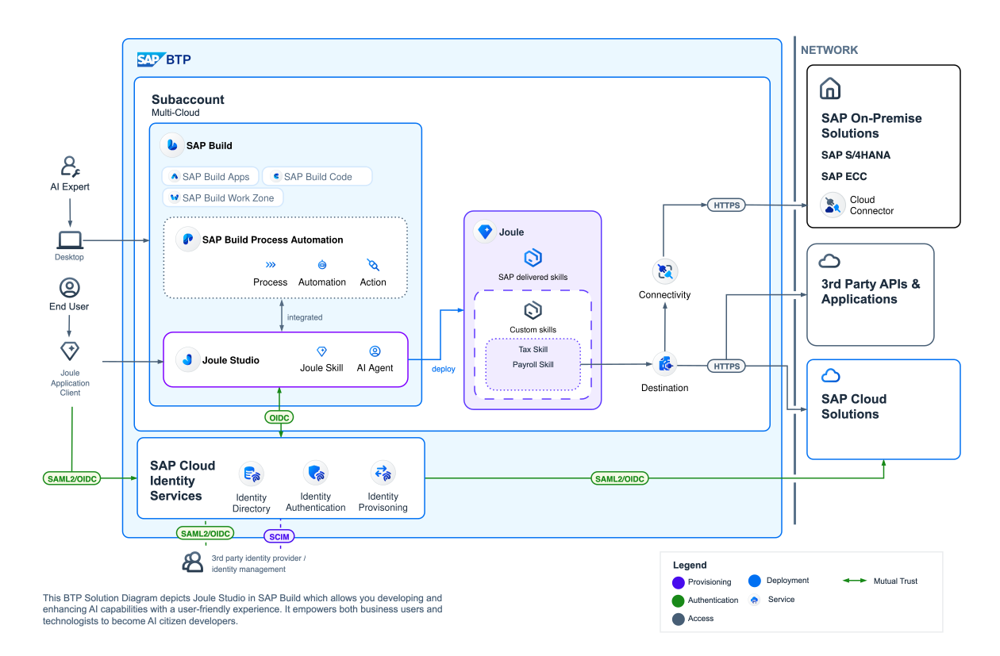
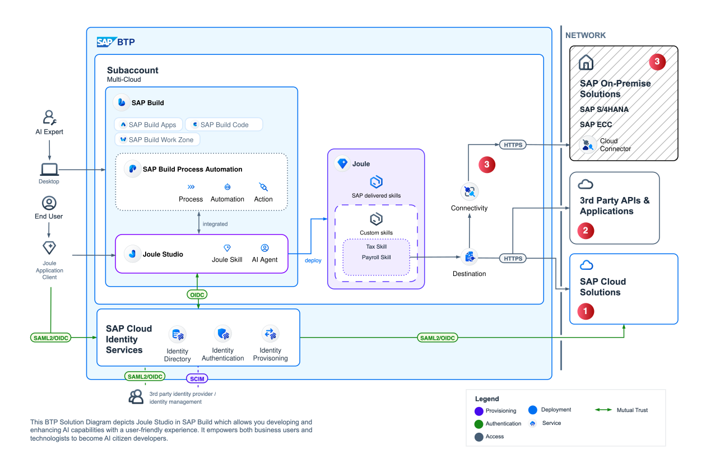
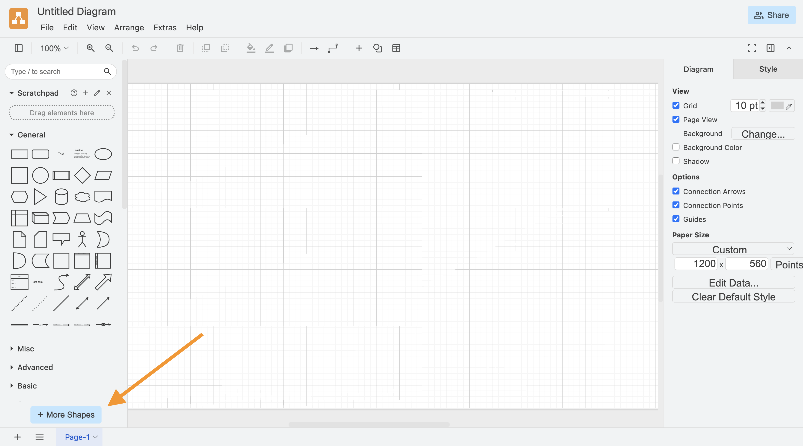
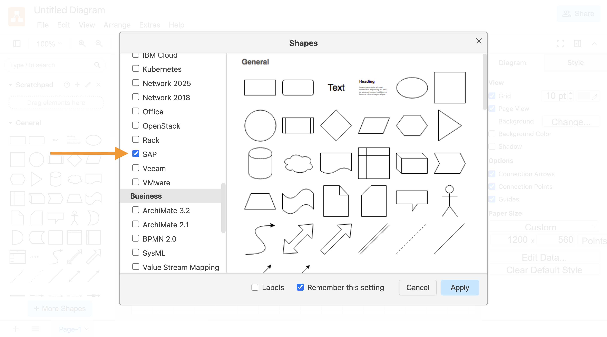
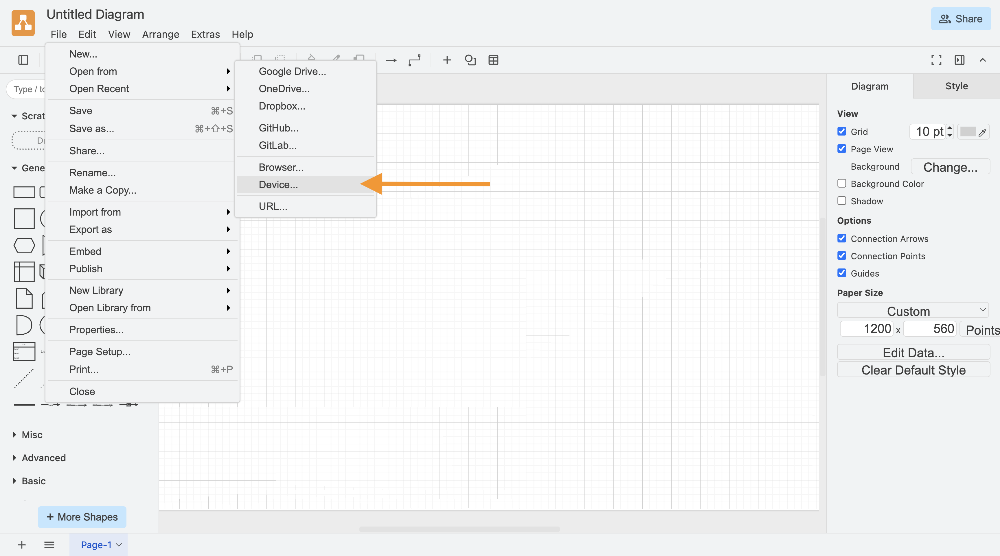

# Exercise 3: Extending a Reference Architecture in draw.io

[< Return to the main page](../../)

 

> [!NOTE]
>
> **Learning Objectives**:
>
> - Connect functional requirements to architecture decisions
> - Identify helpful resources for interpreting BTP Solution Diagrams
> - Learn how to use draw.io to create, modify, and extend BTP Solution Diagrams
>
> **Duration**: ~20 minutes

 

## Step 0. The Reference Architecture Starting Point

The BTP Solution Diagram shown below provides a general starting point for modification or extension. In this exercise we will modify the diagram below to address a case study described in the following step.

> [!NOTE]
>
> The diagram below has been adapted (with a runtime focus for our scenario) from the following resource: [Extend Joule with Joule Studio (SAP Architecture Center)](https://architecture.learning.sap.com/docs/ref-arch/06ff6062dc)

Another helpful resource in understanding the conventions of a BTP Solution Diagram is the [BTP Solution Diagram Repository](https://sap.github.io/btp-solution-diagrams/)—it contains ready-to-use templates and guidelines to get you started. Like many of the resources we'll cover today, the BTP Solution Diagram Repository can also be accessed via the [SAP BTP Guidance Framework](https://discovery-center.cloud.sap/guidance-framework).

 

**Extend Joule with Joule Studio Reference Architecture — BTP Solution Diagram**

 

## Step 1. Case Study — Consolidating Payroll Information

Resource: [Interactive Value Journey — Designing custom Joule skills in Joule Studio](https://url.sap/skilldesign)

Our enterprise, BestRun, uses SAP SuccessFactors as its core HR system, but handles payslips and tax documents through a third-party provider, SecurePayroll. We would like to empower employees to access their payroll and tax information seamlessly from one simple interface, thereby improving response times and reducing HR support tickets.

**Proposed solution:**

Create Joule skills to...

> _Enable employees to securely access payslips and tax documents from third-party payroll systems directly within SAP SuccessFactors using Joule. Simplifies the user experience by removing the need for separate logins and streamlines payroll communication to HR._

 

🧠 **Knowledge check:**

    

        What core modifications do we need to make to the BTP Solution Diagram introduced in the previous step to represent our proposed solution? (click to see)
    

     
    <ol>
        <li>
            SAP SuccessFactors should be represented in the "SAP Cloud Solutions" box
        </li>
        <li>
            SecurePayroll should be represented in the "3rd Party APIs & Applications" box
        </li>
        <li>
            Connectivity Service, Cloud Connector, and the "SAP On-Premise Solutions" box can all be removed since they are not part of the proposed solution
        </li>
    </ol>
     
    

 

## Step 2: Getting Started with draw.io

draw.io is a diagramming solution that is free-to-use, doesn't require login or registration, and offers native integration for SAP BTP service icons and shapes. It can be accessed in-browser or via a desktop application, today we'll use the in-browser version.

1. Open [draw.io](https://app.diagrams.net/)
2. Click on the button **More Shapes** in the bottom left corner
   
3. Scroll down and checkmark the checkbox labelled **SAP** under the **Networking** heading, make sure **Remember this setting** is checked, then click **Apply**
   
4. Download the provided [starter draw.io file](./drawio/joule-studio-ref-arch-starter.drawio)
5. Open the starter draw.io file in [draw.io](https://app.diagrams.net/)
   

 

## Step 3: Modifying the BTP Solution Diagram in draw.io

Recall, we identified the necessary changes to represent our proposed solution in [Step 1](#step-1-case-study--consolidating-payroll-information).

    

        Required changes (click to see)
    

     
    <ol>
        <li>
            SAP SuccessFactors should be represented in the "SAP Cloud Solutions" box
        </li>
        <li>
            SecurePayroll should be represented in the "3rd Party APIs & Applications" box
        </li>
        <li>
            Connectivity Service, Cloud Connector, and the "SAP On-Premise Solutions" box can all be removed since they are not part of the proposed solution
        </li>
    </ol>

 

Let's modify the starter BTP Solution Diagram we opened in the previous step to reflect the required changes.

 

> [!TIP]
>
> Use the SAP shapes we enabled in draw.io, for example, the SAP SuccessFactors logo and text are available under **SAP / Brand Names** in the left-hand toolbar
>
> Expand shapes as needed, the size of the canvas will automatically increase to accommodate your changes

 

    

        Check your work (click to see)
    

     
    

        <a href="./drawio/joule-studio-ref-arch-modified.drawio">Modified draw.io File</a>
    

     
    

 

## Step 4: Extending the Solution's Functionality with an AI Feature

In the previous step, we completed modifications to our BTP Solution Diagram to represent our two new Joule skills for consolidating payroll and tax information.

The proposed solution will work well for many retrieval-focused interactions, but it may not have the needed context to address certain questions.

Consider the members of BestRun's sales team—a significant portion of their compensation is tied to commissions earned on the sales of BestRun's software. Payroll information alone likely won't provide enough context for Joule to answer questions about commissions. **How can we provide Joule with additional context that will help it answer policy-based questions?**

Thankfully, there's already an AI feature we can use to enhance Joule's context with our policy documents.

Can you find it in [SAP Discovery Center's AI Catalog](https://discovery-center.cloud.sap/ai-catalog/)?

> [!TIP]
>
> Use the following filters to narrow down your search:
>
> _AI Types_: **AI Feature**
>
> _Commercial Types_: **Premium**
>
> _Availability_: **Generally Available**
>
> _Product Categories_: **Technology Platform**

 

🧠 **Knowledge check:**

    

        Which AI feature enhances Joule's context with information retrieved from custom documents?
    

     
    

        <a href="https://discovery-center.cloud.sap/ai-feature/fedeca14-3e69-472c-a0ea-82396735c35f/">Document Grounding</a>
         enhances Joule's context for Q&A with information retrieved from custom documents. In the BTP Solution Diagram below, the Microsoft SharePoint integration is shown—Word documents, PowerPoint decks, PDFs, images, etc. can all be accessed from SharePoint by Joule via Document Grounding.  
    

     
    

        <a href="./drawio/joule-studio-ref-arch-extended.drawio">Extended draw.io File</a>
    

     
    

 

[< Return to the main page](../../)