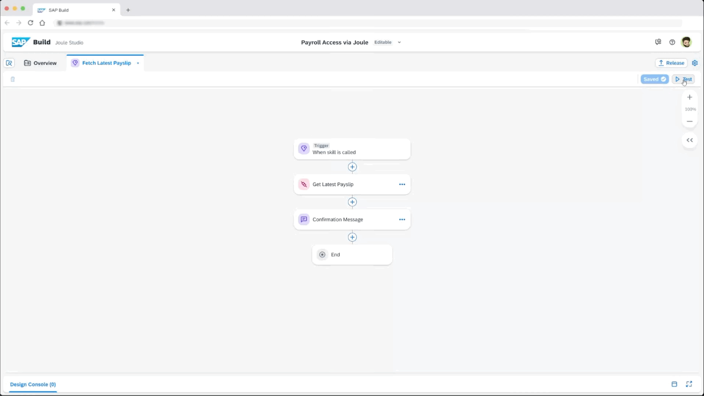

# Exercise 3: Extending a Reference Architecture in draw.io

[< Return to the session's main page](../../)

> [!NOTE]
>
> **Learning Objectives**:
>
> - Connect functional requirements to architecture decisions
> - Identify helpful resources for interpreting BTP Solution Diagrams
> - Learn how to use draw.io to create, modify, and extend BTP Solution Diagrams
>
> **Duration**: ~20 minutes

 

## Step 0. The Reference Architecture Starting Point

Resource: [Extend Joule with Joule Studio (SAP Architecture Center)](https://architecture.learning.sap.com/docs/ref-arch/06ff6062dc)

The BTP Solution Diagram shown below provides a general starting point for modification or extension. In this exercise we will modify the diagram below to address a case study described in the following step.

One helpful resource in understanding the conventions of a BTP Solution Diagram is the [BTP Solution Diagram Repository](https://sap.github.io/btp-solution-diagrams/)—it contains ready-to-use templates and guidelines to get you started. Like many of the resources we'll cover today, the BTP Solution Diagram Repository can also be accessed via the [SAP BTP Guidance Framework](https://discovery-center.cloud.sap/guidance-framework).

 

**Extend Joule with Joule Studio Reference Architecture — BTP Solution Diagram**

 

## Step 1. Case Study — Consolidating Payroll Information

Resource: [Interactive Value Journey — Designing custom Joule skills in Joule Studio](https://url.sap/skilldesign)

Our enterprise, BestRun, uses SAP SuccessFactors as its core HR system, but handles payslips and tax documents through a third-party provider, SecurePayroll. We would like to empower employees to access their payroll and tax information seamlessly from one simple interface, thereby improving response times and reducing HR support tickets.

**Proposed solution:**

Create Joule skills to...

> _Enable employees to securely access payslips and tax documents from third-party payroll systems directly within SAP SuccessFactors using Joule. Simplifies the user experience by removing the need for separate logins and streamlines payroll communication to HR._

An example, in the video below, showcases our proposed solution. Do note, the conversation is shown in Joule Studio's test environment. Upon deployment, the defined custom skill would be accessible through Joule in SAP SuccessFactors.

 

 

🧠 **Knowledge check:**

    

        What core modifications do we need to make to the BTP Solution Diagram introduced in the previous step to represent our proposed solution? (click for answer)
    

     
    <ol>
        <li>
            SAP SuccessFactors should be represented in the "SAP Cloud Solutions" box
        </li>
        <li>
            SecurePayroll should be represented in the "3rd Party APIs & Applications" box
        </li>
        <li>
            Connectivity Service, Cloud Connector, and the "SAP On-Premise Solutions" box can all be removed since they are not part of the proposed solution
        </li>
    </ol>
     
    

 

## Step 2: Getting Started with draw.io

draw.io is a diagramming solution that is free-to-use, doesn't require login or registration, and offers native integration for SAP BTP service icons and shapes. It can be accessed in-browser or via a desktop application, today we'll use the in-browser version.

1. Open [draw.io](https://app.diagrams.net/)
2. Click on the button **More Shapes** in the bottom left corner
   
3. Scroll down and checkmark the checkbox labelled **SAP** under the **Networking** heading, make sure **Remember this setting** is checked, then click **Apply**
   
4. Download the provided [starter draw.io file](./drawio/joule-studio-ref-arch-starter.drawio)
5. Open the starter draw.io file in [draw.io](https://app.diagrams.net/)
   

 
