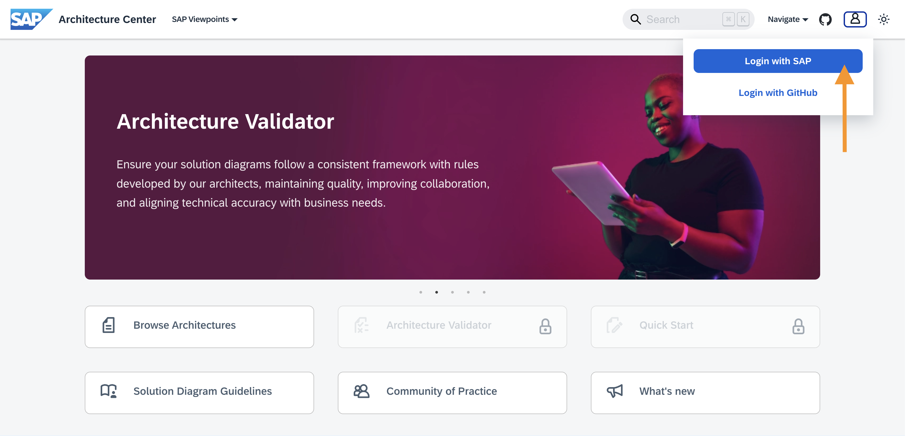
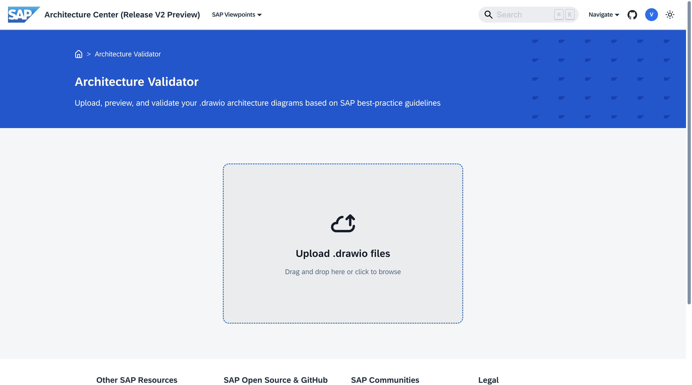
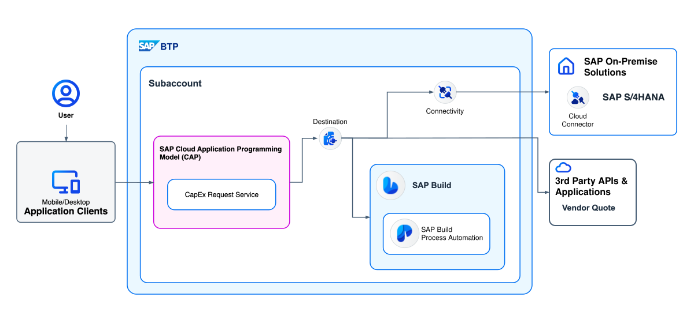

# Exercise 4: Validate your BTP Solution Diagram

[**< Return to the main page**](../../)

 

> [!NOTE]
>
> **Learning Objectives**:
>
> - Learn how to use the Architecture Validator
> - Understand Validator warnings and how to address them
>
> **Duration**: ~10 minutes

 

## The Architecture Validator

For this exercise, you will use a tool called the Architecture Validator on the SAP Architecture Center. Here's what it does:

> Ensure your solution diagrams follow a consistent framework with rules developed by our architects, maintaining quality, improving collaboration, and aligning technical accuracy with business needs.

The Architecture Validator is a great resource to use alongside the [BTP Solution Diagram Guidelines](https://sap.github.io/btp-solution-diagrams/docs/solution_diagr_intro/big_picture/).

 

## Step 1: Ensure You Have an SAP Account

An SAP account is required for this exercise, if you do not already have one, [create your account here](https://www.sap.com/account.html).

 

## Step 2: Accessing the Architecture Validator

1. Navigate to the [SAP Architecture Center](https://architecture.learning.sap.com/)
2. Login with SAP
   
3. Navigate to the Architecture Validator
   

 

## Step 3: Validate your BTP Solution Diagram

Upload the draw.io file you modified in the previous exercise (or the [reference draw.io file here](../ex3/drawio/joule-studio-ref-arch-modified.drawio)) to the Validator and click **Validate**.

 

 

## Step 4: Interpret your Validator Results

The Architecture Validator codifies and enforces a wide variety of rules intended to promote architectural best practices. The rules cover connectivity, security, generative AI governance, application groupings, and more.

If you used any of the draw.io files from the previous exercise ([starter](../ex3/drawio/joule-studio-ref-arch-starter.drawio), [modified](../ex3/drawio/joule-studio-ref-arch-modified.drawio), [extended](../ex3/drawio/joule-studio-ref-arch-extended.drawio)), they should have all passed validation without any warnings.

To see examples of Validator warnings, submit a diagram with several mistakes to the validator.

1. Return to the [Architecture Validator](https://architecture.learning.sap.com/architecture-validator)
2. Download this [invalid diagram draw.io file](./drawio/invalid-example.drawio)
3. Upload the draw.io file to the validator

After completing the steps above, you should have encountered **2 warnings**.

🧠 **Knowledge check:**

    

        What are the <b>2 warnings</b> and how would you fix them?
    

     
    The two warnings are:
    <ol>
        <li>
            CAP-to-External Integration Requires Destination Service
        </li>
        <li>
            SAP Build Components Must Be Grouped Under SAP Build SuperArea
        </li>
    </ol>
     
    
     
     
    

        <a href="./drawio/valid-example.drawio">Valid example draw.io file</a>  
        <b>Explanation:</b>  The diagram shows a <a href="https://cap.cloud.sap/docs/">Cloud Application Programming Model (CAP)</a> app that connects with SAP S/4HANA, SAP Build Process Automation, and a 3rd-party Vendor Quote App to facilitate Capital Expenditure Requests.  
        First, it is a best practice to use the Destination Service for securely managing and abstracting connection details for external systems. This allows the CAP application to retrieve credentials and URLs at runtime without hardcoding them.
          Second, it is a best practice to group SAP Build Process Automation within SAP Build for additional clarity.
    

 

[**Continue to Exercise 5 >**](../ex5/)
