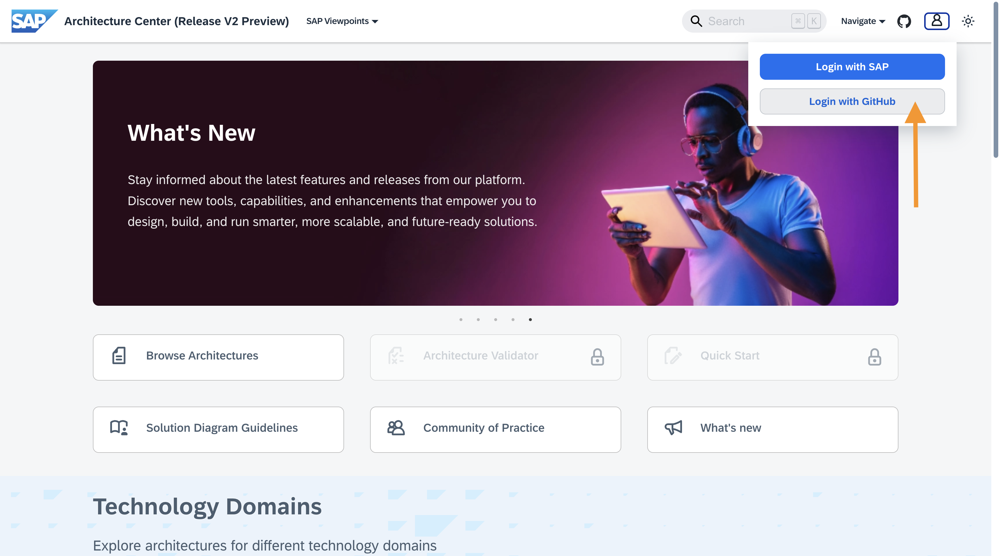
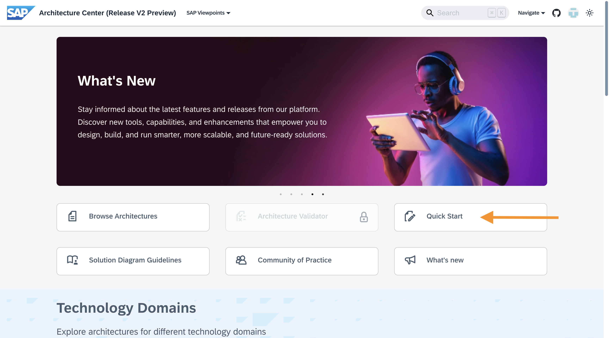
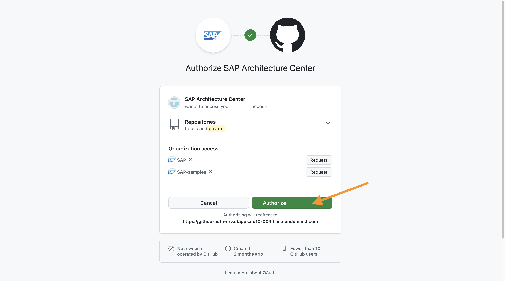
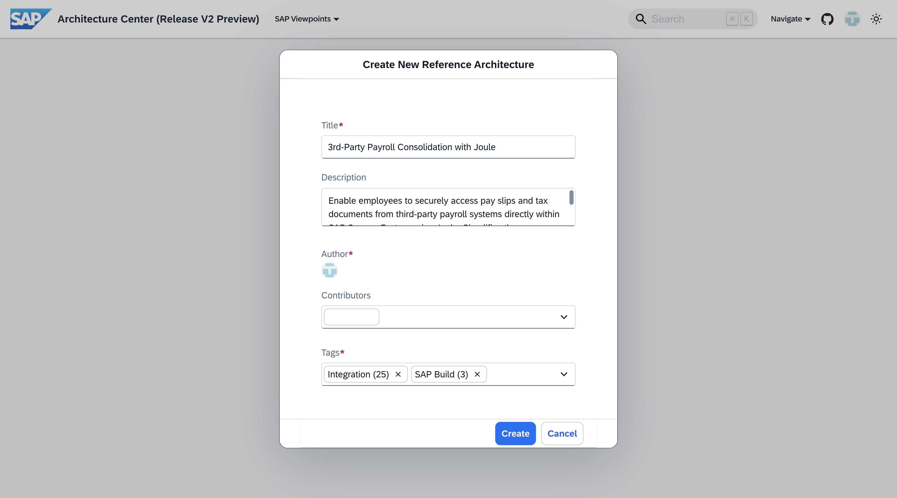
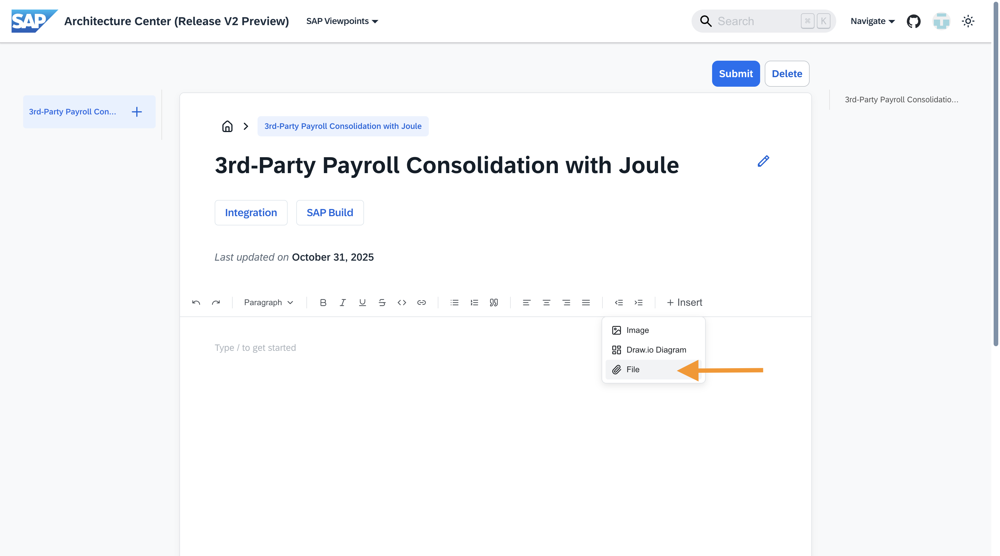
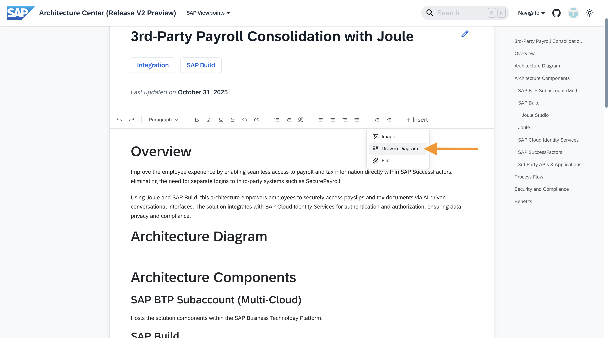
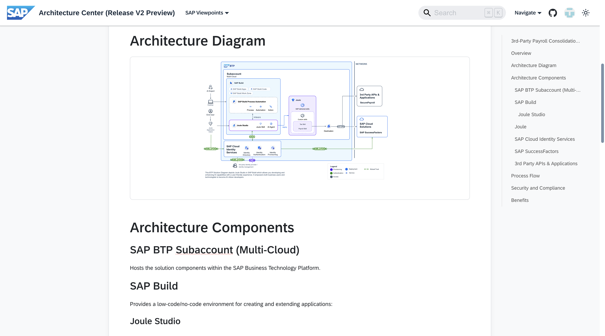

# Exercise 5: Make Your Reference Architecture Official

[**< Return to the main page**](../../)

<br/>

> [!NOTE]
>
> **Learning Objectives**:
>
> - Example learning objective
>
> **Duration**: ~10 minutes

<br/>

## Contributing to the SAP Architecture Center

So far, we have covered all of the tools and resources you'll need to create, modify, or extend a reference architecture. We have even modified and extended an existing reference architecture to represent a proposed solution for a particular case study.

If you are interested in sharing a reference architecture with your peers, colleagues, and anyone who might find it useful, then the [SAP Architecture Center | Community of Practice](https://architecture.learning.sap.com/community/intro) is the perfect place to start.

In this exercise you will learn how to turn your new reference architecture into a contribution.

<br/>

## Step 1: Enable the Quick Start Feature

> [!NOTE]
>
> The Quick Start feature uses a GitHub OAuth application to fork the [SAP Architecture Center GitHub repository](https://github.com/SAP/architecture-center), create a commit for your contribution, and open a pull request on your behalf.
>
> If you do not want to provide the OAuth app access to your GitHub account, you can simply follow along with the demo. If you have already provided access to the OAuth app and want to revoke its access after you have completed the exercise, follow [GitHub's docs here](https://docs.github.com/en/apps/oauth-apps/using-oauth-apps/reviewing-your-authorized-oauth-apps).

SAP Architecture Center now enables you to create a new, structured, reference architecture contribution without needing to use a code editor like VS Code. You can use the [modified](../ex3/drawio/joule-studio-ref-arch-modified.drawio) (or [extended](../ex3/drawio/joule-studio-ref-arch-extended.drawio)) draw.io files from exercise 3 as the foundation for your contribution in quick start.

1. Navigate to the [SAP Architecture Center](https://architecture.learning.sap.com/@preview/releasev2/) homepage and click **Login with GitHub**
   
2. Open Quick Start
   
3. **Authorize** the SAP Architecture Center OAuth app
   

<br/>

## Step 2: Create Your Contribution in Quick Start

1. Enter your contribution details:

   **Title**:

   ```
   3rd-Party Payroll Consolidation with Joule
   ```

   **Description**:

   ```
   Enable employees to securely access pay slips and tax documents from third-party payroll systems directly within SAP SuccessFactors using Joule. Simplifies the user experience by removing the need for separate logins and streamlines payroll communication to HR.
   ```

   **Tags**

   ```
   Integration, SAP Build
   ```

   <br/>

   

2. Click **Create**

<br/>

## Step 3: Edit Your Contribution in Quick Start

> [!WARNING]
>
> Clicking **Submit** while in Quick Start will automatically open a pull request on the [SAP Architecture Center GitHub repository](https://github.com/SAP/architecture-center) with your changes. Since today's content is simply intended to get you started, **please do not click Submit**. If you have already clicked **Submit**, no worries, we'll close out the pull request for you after the lab ends.

Quick Start enables you to edit your contribution directly in the browser or insert content from a file. Today, we'll use a contribution that has already been drafted in a Word document.

2. Hover over **Insert** and click on **File**
   
3. Upload this [Word document](Ref-Doc-Arch.docx) describing your reference architecture
4. Remove the placeholder text under the **Architecture Diagram** heading
5. Hover over **Insert** and click on **Draw.io Diagram**
   
6. Upload your modified diagram from the previous exercises
   

## Step 4: Celebrate!

Congratulations on completing all of the exercises in this lab session, we hope you enjoyed the journey!

[**< Return to the main page**](../../)
